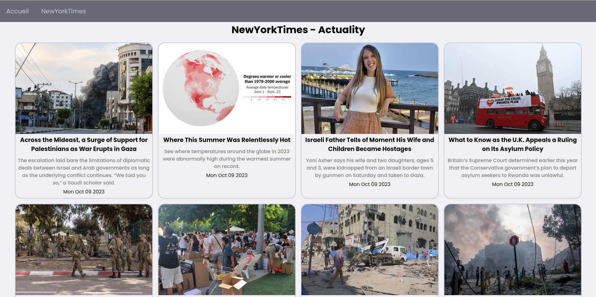

# NewsNook - Agrégateur de Nouvelles Personnalisé



Ce projet est construit avec React et alimenté par des API gratuites et publiques.

## Prérequis

Avant de pouvoir construire et exécuter ce projet, assurez-vous d'avoir Node.js et npm (ou yarn) installés sur votre système.

## Installation

1. Clonez ce référentiel vers votre machine locale :

   ```bash
   git clone https://github.com/VotreNom/NewsNook.git
   ```

2. Accédez au répertoire du projet :

   ```bash
   cd NewsNook
   ```

3. Installez les dépendances du projet en exécutant la commande suivante :

   ```bash
   npm install
   ```

   ou

   ```bash
   yarn
   ```

## Utilisation

1. Lancez le projet en mode développement en exécutant la commande suivante :

   ```bash
   npm dev
   ```

   ou

   ```bash
   yarn dev
   ```

   Le site web sera accessible à l'adresse `http://localhost:5173` (peux changer selon votre configuration / la disponibilité du port) dans votre navigateur.

## Apprentissage en React et Utilisation de React Query

Ce projet m'a permis de m'améliorer en React de plusieurs manières :

- J'ai appris à créer des composants React réutilisables et à gérer l'état de l'application de manière efficace.
- J'ai utilisé React Query pour gérer la récupération des données depuis les API de manière simple et efficace, remplaçant ainsi l'utilisation de useEffect pour la gestion des données asynchrones.
- J'ai amélioré mes compétences en manipulation de données JSON et en affichage de contenu dynamique.
- J'ai pratiqué la création d'une interface utilisateur conviviale et réactive en React.
- J'ai renforcé mes compétences en développement web front-end en utilisant les dernières technologies et bonnes pratiques.

N'hésitez pas à explorer le code source pour voir comment j'ai implémenté ces concepts et à poser des questions si vous en avez ou alors à me proposer des améliorations en créant des [Issues](https://github.com/Mitotow/NewsNook/issues).

## Licence

Ce projet est sous licence [MIT](LICENSE).